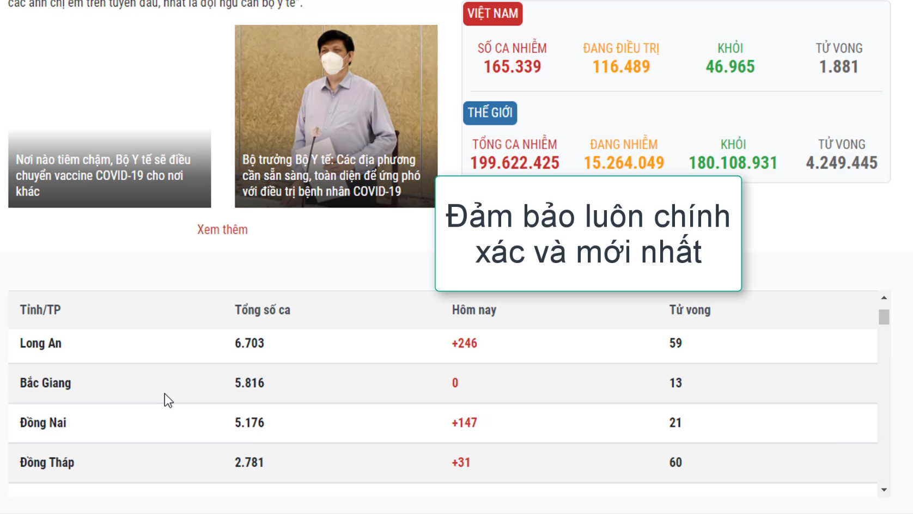

# Chia sẻ API thống kê dữ liệu covid 19 tại Việt Nam.
## Link API: covid.huukhuongit(.)tk
### Thông tin:
- Dữ liệu được crawl trực tiếp từ website của Bộ Y tế => Thông tin đáng tin cậy, cập nhật thường xuyên.
- Dữ liệu trả về kiểu mảng JSON với phần tử đầu tiên là thống kê tổng hợp (bao gồm tổng số ca, đang chữa trị, đã khỏi bệnh, số ca tử vong); 63 phần tử kế tiếp là thông tin của từng tỉnh/thành phố (tên địa phương, số ca, ca mắc mới, số ca tử vong)
- Ngôn ngữ sử dụng: PHP
- Hosting: 123host (free)
### Công dụng: Tuỳ mục đích sử dụng.
### App demo:
- Ngôn ngữ Java, sử dụng các hình ảnh tuyên truyền từ internet.
- Có tham khảo giao diện từ: Papaya Coders, Rajendra Singh Bisht và Stayshubh.

## Video giới thiệu

